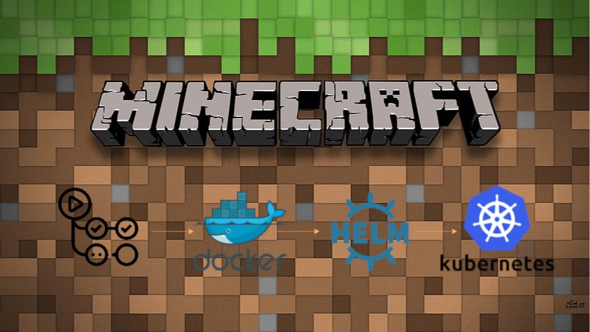

Minecraft Server in Kubernetes 🎮
==============

This demonstrates how to run Minecraft in Kubernetes. It builds on the work of 
the [itzg Minecraft Server Docker Image](https://hub.docker.com/r/itzg/minecraft-server/) 
to create a docker container in Kubernetes.

We also use Helm to make installation, and customization, a breeze. 🌪️

This repository demonstrates how to run in a local Kubernetes cluster using
local disks. 

<!--  -->
<div style="text-align: center;">
    
</div>

How To Install 🛠️

------

### Prerequisites 
* Have a Kubernetes cluster, be able to SSH to the nodes in your cluster
* Have Helm installed
* Have your `kubeconfig` command line set up to talk to your cluster
* Have cluster admin privileges on this cluster
* Clone this repository to your computer

### Step 1: Create a directory for local files 📁

SSH to one of the nodes in your Kubernetes cluster. Create a directory where you want Minecraft files to exist.

Example:

```bash
ssh your_kubernetes_host
sudo mkdir -p "/mnt/local-volumes/minecraft"
sudo chmod 777 "/mnt/local-volumes/minecraft"
```

Get the kubernetes node name name of the host machine
on which you just added the directory.

Edit [values.yaml](helm/minecraft/values.yaml#L7). Update Line 7 to your node's hostname.
If you used a different path for your worldfile, update volume.path in [values.yaml](helm/minecraft/values.yaml#L17).

### Step 2: Configure your Minecraft Server ⚙️

The [itzg Minecraft Server Docker Image](https://hub.docker.com/r/itzg/minecraft-server/) 
allows you to configure settings in the minecraft
server by setting environment variables. 

You can edit [helm/minecraft/deployment.yaml](helm/minecraft/templates/deployment.yaml#L1) to add or
change environment variables for your purposes. See lines 30-35 for examples. See the minecraft-server docker image page for documentation on configuring your server.

We've included just a couple of the most common configurations in [values.yaml](helm/minecraft/values.yaml#L10) like gamemode, message of the day, and port.

### Step 3: Adjust port 🔧

Choose one of these two options:

1. Widen the range of ports that kube apiserver accepts to allow 25565
The way you would do this differs between the OS and Kubernetes distrobution that you're using.
[This is one way](https://github.com/k3s-io/k3s/issues/444#issuecomment-751653917) if you are using k3s, at least on linux.

2. Change the port
Update the [values.yaml](helm/minecraft/values.yaml) file to change the port to 30565, or any other valid port you wish.

Note: You may need to open the port if your host system has a firewall installed.

### Step 4: Helm install 🚀

Now, apply the configuration to Kubernetes. `cd` to the project root and run:

`helm upgrade --install minecraft helm/minecraft --namespace minecraft --create-namespace`


### Step 5: Connect 🌐

Suppose that your kubernetes node has a public ip address of 192.168.1.203.

If you chose option 1 in Step 3 then you do not need to specify a port when connecting to your server. For this example you would only need to connect to `192.168.1.203`.

Othherwise, when you configure your minecraft server, connect to `{your external ipv4}:{the port your chose}` so for this examle if you chose port 30565 then you would connect to `192.168.1.203:30565`.


Invitation to Help
------

Interesting: 

Running on GKE: If anyone is interested in figuring this out the details to make this work
on Google Cloud GKE or Azure AKS, please send me a PR.

### Server properties
You can change properties of server configurating by [environment variables kubernetes](https://docker-minecraft-server.readthedocs.io/en/latest/variables) or [server properties](https://docker-minecraft-server.readthedocs.io/en/latest/variables)

### Mods
You can add [plugins](https://dev.bukkit.org/) download and drafted in /mnt/local-volumes/minecraft

### Commands
Run commands with: `kubectl exec -i -n minecraft pod/<pod-id> rcon-cli`

Link: https://www.digminecraft.com/game_commands/index.php